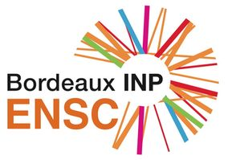

# Online material for AI course - Saft

[Ecole Nationale Supérieure de Cognitique](https://ensc.bordeaux-inp.fr)

## Lectures/Demos

- [Machine Learning in action](https://bpesquet.github.io/mlhandbook/fundamentals/machine_learning_in_action.html)
- [Machine Learning foundations](https://bpesquet.github.io/mlhandbook/fundamentals/machine_learning_foundations.html)
- [Decision Trees And Random Forests](https://bpesquet.github.io/mlhandbook/algorithms/decision_trees_and_random_forests.html)
- [Artificial Neural Networks](https://bpesquet.github.io/mlhandbook/algorithms/artificial_neural_networks.html)
- [Convolutional Neural Networks](https://bpesquet.github.io/mlhandbook/algorithms/convolutional_neural_networks.html)
- [Recurrent Neural Networks](https://bpesquet.github.io/mlhandbook/algorithms/recurrent_neural_networks.html)
- [Generative Deep Learning](https://bpesquet.github.io/mlhandbook/algorithms/generative_deep_learning.html)

## Practicals

- [Predict Heart Disease](https://colab.research.google.com/github/bpesquet/machine-learning-katas/blob/master/notebooks/training_models/heart_disease.ipynb)
- [Classify Planar Data](https://colab.research.google.com/github/bpesquet/machine-learning-katas/blob/master/notebooks/training_models/planar_data.ipynb)
- [Predict Diabetes Evolution](https://colab.research.google.com/github/bpesquet/machine-learning-katas/blob/master/notebooks/training_models/diabetes.ipynb)
- [Classify Fashion Items](https://colab.research.google.com/github/bpesquet/machine-learning-katas/blob/master/notebooks/training_models/fashion_mnist.ipynb)
- [Classify Common Images](https://colab.research.google.com/github/bpesquet/machine-learning-katas/blob/master/notebooks/training_models/cifar10.ipynb)
- [Distinguish Dogs vs. Cats](https://colab.research.google.com/github/bpesquet/machine-learning-katas/blob/master/notebooks/training_models/dogs_vs_cats_keras.ipynb)
- [Forecast The Weather](https://colab.research.google.com/github/bpesquet/machine-learning-katas/blob/master/notebooks/training_models/jena_weather.ipynb)

## Use Case: Battery Prognosis

- [Li-ion battery prognosis using Machine Learning]()
- [Python code for plotting dataset](battery_prognosis/ames_battery_plot.py)
- [Python code for exporting dataset to CSV file](battery_prognosis/ames_battery_export.py)
